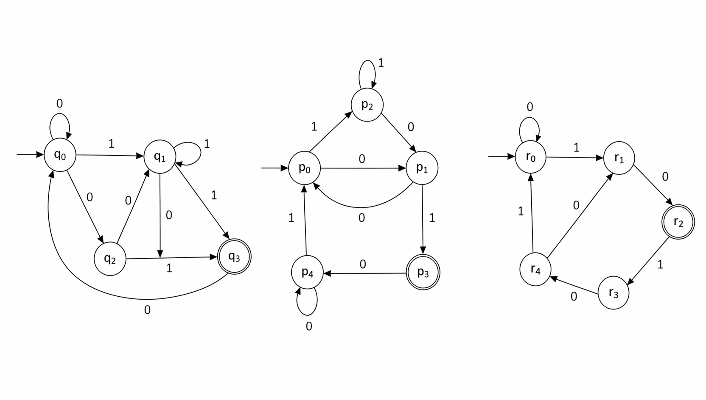
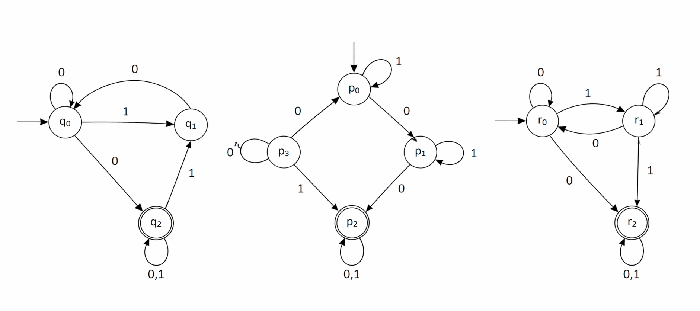

# Trabajo Práctico N° 2.3

## Expresiones Regulares y Autómatas

## Ejercicio 1 – Interpretación de Expresiones Regulares

Describa el lenguaje denotado por cada una de las siguientes expresiones regulares:

* Si el lenguaje es **finito**, listar todas sus cadenas.
* Si es **infinito**, describirlo por comprensión.

|      | Expresión Regular        |      |Expresión Regular         |
|:----:|--------------------------|:----:|--------------------------|
| a)   | (z*y)x                   | g)   | (xy) + z                 |
| b)   | x*(yz)*                  | h)   | (z + y) + x              |
| c)   | (x + y)z                 | i)   | x(z + y)*                |
| d)   | (z + y)*                 | j)   | (x(x + y))yy             |
| e)   | (yy)*                    | k)   | (xx*)* + (yy*)           |
| f)   | (x* + y*)* + (z + x)     | l)   | (xy)z*                   |

### Para pensar:

> a. ¿Cuál de las expresiones genera **solo una cadena**?
> 
> b. ¿Cuál genera **todas las cadenas posibles** sobre {x, y}?
> 
> c. Da un ejemplo de cadena que pertenezca a (x* + y*)* pero no a x*y*
> 
> d. ¿Qué cambia si en (yy)* reemplazás * por +?

### Minidesafío de programación 1
> a. Escribí una función genera_cadenas(er, n) que genere todas las cadenas de longitud menor a n para una ER simple (sin paréntesis anidados).
> 
> b. Implementá un validador usando librerías del lenguaje (por ejemplo, regex) y verificá ejemplos.
> 
> c. Compará las cadenas generadas por tu función con las cadenas aceptadas por el regex del lenguaje y detectá posibles inconsistencias.

## Ejercicio 2 – Lenguajes, ER y Autómatas

Para cada lenguaje:

1. Describirlo formalmente.
2. Escribir una expresión regular (ER).
3. Construir un autómata finito que lo reconozca.

a) Cadenas con un número impar de x seguidas de un número par de y, o la cadena xyyx.

b) Cadenas con una cantidad impar de repeticiones de xy y un número par de y.

c) Cadenas donde cada y está:

* precedida inmediatamente por xx
* seguida inmediatamente por xxx

### Para pensar:

> Construí un AFD **mínimo** solo para “cantidad par de y”.
> 
> ¿Cómo combinarías dos autómatas usando unión?
> 
> ¿Es determinista o no determinista tu autómata inicial? ¿Por qué?
> 
> ¿Podés describir el lenguaje (c) usando solo palabras (sin ER)?

### Minidesafío de programación 2
> Usá el generador de cadenas implementado en el punto anterior y los simuladores de AFD que desarrollaste en el TP 2.1 y verificá la aceptación de las cadenas generadas.

## Ejercicio 3 – Modelado de Lenguajes

Para cada lenguaje:

1. Escribir una expresión regular.
2. Diseñar un autómata finito.

a) Cadenas formadas por:

* cero o más a's
* seguidas de cero o más cantidad impar de b's
* seguidas de cero o más cantidad par de c's
* y terminan en aa o ab

b) Cadenas que contienen:

* la subcadena 01 repetida una o más veces **o**
* la subcadena 010 repetida una o más veces

### Para pensar

> ¿Tu ER acepta la cadena vacía?
> 
> Da un ejemplo de cadena **límite** (caso borde).
> 
> ¿Tu autómata tiene estados innecesarios?
> 
> ¿Cómo verificarías que tu solución es correcta?

### Minidesafío de programación 3
> Usá el generador de cadenas implementado en el ejercicio 1 y los simuladores de AFD que desarrollaste en el TP 2.1 y verificá la aceptación de las cadenas generadas.

## Ejercicio 4 – Conersión de ER a AFND

Utilizando los esquemas de construcción (unión, concatenación y estrella de Kleene), construir un *AFND* para los siguientes lenguajes.

**Recomendación:** Identificá los subbloques de cada ER antes de construir el autómata.

a)
L = { w ∈ {a, b}* | w = (ab)* ba + bb(aba)* }

b)
L = { w ∈ {a, b}* | w = (b + ab*aa + bba*ab)(ab*aa) }

c) 
L = { w ∈ {a, b}* | w = aba(ba + ab)*(b + ab) }

d) 
L = { w ∈ {a, b}* | w = (abab)* + (aba* + bb)* }

c) 
L = { w ∈ {a, b}* | w = ((ab*)*ab)* }

### Para pensar

> ¿Cuál de las expresiones parece más compleja? ¿Por qué?
> 
> ¿Podés simplificar alguna ER antes de convertirla?
> 
> ¿Tu AFD es mínimo?

## Ejercicio 6 – Conversión de AFD a ER - Método Gráfico

Dado los siguientes autómatas finitos determinista, obtener la expresión regular equivalente mediante método gráfico.

  
  

### Para Pensar:
> Eliminá un estado y escribí la nueva transición equivalente.
> 
> ¿Qué pasa si eliminás primero un estado distinto?
> 
> ¿El resultado es único?

## Ejercicio 7 – C Conversión de AFD a ER - Método Algebraico

A partir de los AFND obtenidos en el Ejercicio 4, obtener el AFD equivalente y encontrar una expresión regular para cada lenguaje usando el método algebraico.

### Para pensar:

> Compará la ER obtenida con la original usada en la definición de L.
> 
> ¿El resultado es más complejo o más simple que el original?
> 
> ¿Tiene sentido considerar los estados residuales? ¿y los estados inalcanzables?
