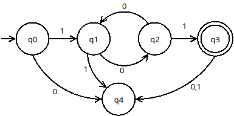
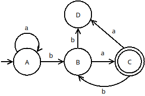

# Trabajo Práctico Nº 1 – Lenguajes Formales

## Actividad 1 - Explorando Autómatas Finitos Deterministas
Tiempo estimado: 30 minutos

Considere los siguientes AFD:
<p align="center">
  
  
</p>


Para cada uno identifique:

> a - Conjunto de estados
> 
> b - Alfabeto
> 
> c - Estado inicial
> 
> d - Conjunto de estados de aceptación
> 
> e - Función de transición ${\delta}$ y tabla de transición

### Mini-desafío 1:

* Use el simulador https://automata-simulation.vercel.app/ para probar el funcionamiento de los autómatas de la Actividad 1.

* Conjeture sobre las cadenas aceptadas por cada autómata

### Formalización:

* Para cada *AFD* escriba una aplicación de ${\delta}$ 

* Escriba el lenguaje aceptado por cada *AFD*

## Actividad 2 - Construcción de Autómatas Finitos Deterministas

Tiempo estimado: 60 minutos

Describa los *AFD* que aceptan los siguientes lenguajes sobre el alfabeto ${\Sigma}$ = {0,1}

> a - El conjunto de todas las cadenas que terminan en 00.
>
> b - El conjunto de todas las cadenas que contienen al menos un 1.
>
> c - El conjunto de todas las cadenas con tres ceros consecutivos en cualquier posición.
>
> d - El conjunto de cadenas que contengan la subcadena 011.
>
> f - El conjunto de cadenas que contengan una cantidad par de 0’s e impar de 1’s.

### Mini-desafío 2:
Implemente un simulador simple de *AFD* en Python y úselo para probar sus diseños verificando la aceptación/rechazo de cadenas.

Ejemplo de estructura sugerida:

```python
Q = {"q0","q1","q2"}
sigma = {"0","1"}

delta = {
("q0","0"):"q1",
("q0","1"):"q0",
("q1","0"):"q2",
("q1","1"):"q0",
("q2","0"):"q2",
("q2","1"):"q1"
}

q0 = "q0"
F = {"q2"}

def run(w):
    estado = q0
    for a in w:
        estado = delta[(estado,a)]
    return estado in F
```
Antes de probar sus diseños, ejecute el código sugerido con las cadenas: 111, 110111, 1000 y 01.

## Actividad 3 — Lenguajes que no son regulares

Tiempo: 45 minutos

Analizar el lenguaje: L = { $a^nb^n$ | $n$ es natural  } 

Preguntas:

> a - ¿Puede reconocerse con un AFD?
>
> b - Intente construir uno
>
> c - ¿Qué problema aparece?

### Formalización:
Aplique el Lema de Bombeo para demostrar que el lenguaje no es regular

## Actividad 4 — Automatas Modulares
Tiempo:30 minutos

Los números divisibles por $M$ en base $b$ forman un lenguaje regular. Sea $b$ una base definimos ${\Sigma}$ = { ${0,...,b-1}$ } los lenguajes:

```
L = { w ∈ Σ* | val_b(w) ≡ 0 mod M }
```

son lenguajes regulares.

Construya un *AFD* para los siguientes lenguajes:

> a - Números binarios divisibles por 5
>
> b - Números en base 3 divisibles por 7
> 
> c - Pruebe sus diseño con el simulador construído en la *Actividad 2*

## Actividad 5 — Automatas Finitos No Deterministas
Tiempo: 90 minutos
Considere el siguiente AFND ${M = (Q, \Sigma, \delta, p_0, F)}$ definido de la siguiente manera:

| Σ    | 0       | 1          |
| ---- | ------- | ---------- |
| → q0 | {q0}    | {q0,q1,q2} |
| q1   | {q2,q3} | ∅          |
| q2   | ∅       | {q4}       |
| q3   | {q5}    | ∅          |
| q4   | ∅       | {q5}       |
| *q5  | {q5}    | {q5}       |

> a - Dibuje el AFND de la tabla.
>
> b - Determinar si las cadenas 001, 010111, 011, 100, 01001, 01110 son aceptadas por el AFND. Realice la aplicación de la función ${\delta}$.

### Mini-desafío 3:
* Implemente un simulador simple de *AFND* en Python y úselo para implemetar el AFND de la actividad y verificar la aceptación/rechazo de cadenas.

Código sugerido:
```
class AFND:
    
    def __init__(self, Q, sigma, delta, q0, F):
        self.Q = Q
        self.sigma = sigma
        self.delta = delta
        self.q0 = q0
        self.F = F

    def paso(self, Q_actual, simbolo):
        siguiente_Q = set()
        
        for estado in Q_actual:
            if (estado, simbolo) in self.delta:
                siguiente_Q |= self.delta[(estado, simbolo)] #|= unión de conjuntos
                
        return siguiente_Q

    def run(self, w, modo_extendido=True):
        
        Q_actual = {self.q0}
        
        if modo_extendido:
            print("Estado inicial:", Q_actual)
        
        for i, simbolo in enumerate(w):
            
            Q_actual = self.paso(Q_actual, simbolo)
            
            if modo_extendido:
                print(f"Paso {i+1} leyendo '{simbolo}' -> {Q_actual}")
        
        aceptar = any(s in self.F for s in Q_actual)
        
        if modo_extendido:
            print("Estados finales:", Q_actual)
            print("Cadena aceptada?", aceptar)
        
        return aceptar
```
> c - Obtener un AFD equivalente al AFND de la actividad

### Mini-desafío 4:
* Modifique la clase AFND definida para que permita convertir un AFND en AFD y verifique los resultados obtenidos

```
 def obtener_AFD(self):

        q0 = frozenset({self.q0}) #conjunto inmutable
        afd_Q = {q0}
        sin_procesar = [q0]

        afd_delta = {}
        afd_F = set()

        while sin_procesar:

            # completar

        return {
            "Q": afd_Q,
            "sigma": self.sigma,
            "delta": afd_delta,
            "q0": q0,
            "F": afd_F
        }
```
