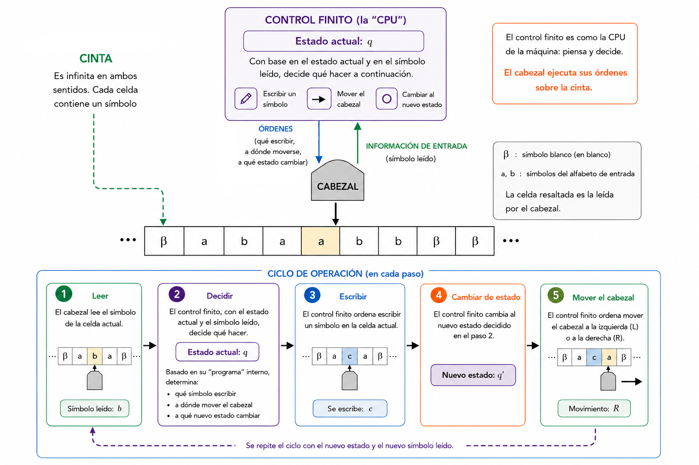

# Funcionamiento de una Máquina de Turing

Una **Máquina de Turing (MT)** es un modelo abstracto de computación compuesto por:

1. Una cinta potencialmente infinita, 
2. Un cabezal de lectura y escritura, y 
3. Un control finito encargado de determinar qué acción debe realizarse en cada paso de acuerdo al símbolo leído en la cinta y la función de transición definida.

La cinta se encuentra dividida en celdas, cada una de las cuales almacena un símbolo. 

Inicialmente, la cadena de entrada se escribe sobre la cinta y el resto de las celdas contienen un símbolo especial denominado blanco (usualmente representado por $\beta$).

El cabezal puede leer el contenido de la celda actual, escribir un nuevo símbolo sobre ella y desplazarse una posición hacia la izquierda o hacia la derecha. 

En cada instante, la máquina se encuentra en un determinado estado perteneciente a un conjunto finito de estados.

El comportamiento de la máquina está definido por una **función de transición**, que especifica qué acción debe realizarse para cada combinación de estado actual y símbolo leído. En cada paso de cómputo, la máquina:

1. Lee el símbolo contenido en la celda bajo el cabezal.
2. Consulta la función de transición utilizando el estado actual y el símbolo leído.
3. Escribe el símbolo indicado por la transición.
4. Cambia al nuevo estado especificado.
5. Desplaza el cabezal una posición hacia la izquierda o hacia la derecha.

Este proceso se repite sucesivamente hasta que la máquina alcanza un estado de aceptación, un estado de rechazo o continúa ejecutándose indefinidamente.

  

Desde un punto de vista operativo, una Máquina de Turing puede interpretarse como un dispositivo que combina un control finito —responsable de decidir las acciones a realizar— con una memoria potencialmente ilimitada representada por la cinta. Gracias a esta capacidad de almacenamiento, las Máquinas de Turing pueden realizar cálculos mucho más complejos que los autómatas finitos o los autómatas con pila.

La evolución de una Máquina de Turing durante su ejecución suele describirse mediante **configuraciones instantáneas**, que indican el contenido de la cinta, la posición del cabezal y el estado actual de la máquina. Una computación consiste en una secuencia de configuraciones obtenidas al aplicar repetidamente la función de transición.

De esta manera, una Máquina de Turing proporciona un modelo formal para describir algoritmos y estudiar qué problemas pueden resolverse mediante procedimientos efectivos de cálculo.

