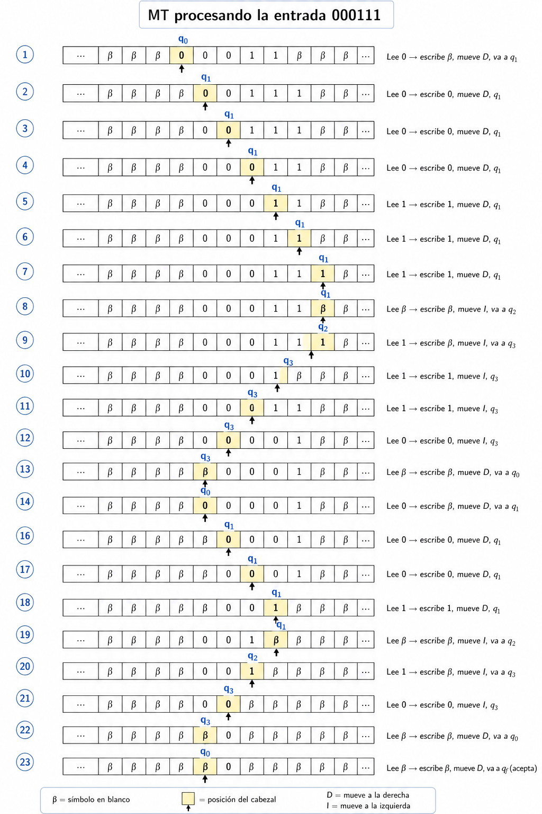

# Máquina de Turing

La notación formal que vamos a emplear para una Máquina de Turing ($MT$) es similar a la utilizada para los autómatas finitos y los autómatas a pila.

Una $MT$ se describe mediante la siguiente séptupla:

$$
M = (Q, \Sigma, \Gamma, \delta, q_0, \beta, F)
$$

donde sus componentes tienen el siguiente significado:

- $Q$: conjunto finito de estados de la unidad de control.

- $\Sigma$: conjunto finito de símbolos de entrada.

- $\Gamma$: conjunto completo de símbolos de la cinta. El alfabeto de entrada $\Sigma$ es siempre un subconjunto de $\Gamma$.

- $\delta$: función de transición. Sus argumentos son un estado $q$ y un símbolo de cinta $a$.

Si está definida, el valor de la función es $\delta(q, X) = (p, Y, D)$

donde:

  1. $p$ es el siguiente estado de $Q$.
  2. $Y$ es el símbolo de $\Gamma$ que se escribe en la celda actual de la cinta, reemplazando al símbolo que se encontraba allí.
  3. $D$ indica la dirección de movimiento del cabezal:
     - $L$ ($Left$): una posición hacia la izquierda.
     - $R$ ($Right$): una posición hacia la derecha.

- $q_0$: estado inicial. Es un elemento de $Q$ en el que comienza la ejecución de la máquina.

- $\beta$: símbolo blanco (espacio en blanco). Pertenece a $\Gamma$ pero no a $\Sigma$. Inicialmente aparece en todas las celdas de la cinta excepto en aquellas que contienen la entrada.

- $F$: conjunto de estados finales o de aceptación. Es un subconjunto de $Q$.

## Configuración de una Máquina de Turing

En una configuración, se muestran las casillas de la cinta comprendidas entre el símbolo más a la izquierda y el símbolo más a la derecha que no sean espacios en blanco. Cuando se dé la condición especial de que la cabeza está señalando a uno de los espacios en blanco que hay antes o después de la cadena de entrada, también tendremos que incluir en la configuración un número finito de espacios en blanco.

Además de representar la cinta, tenemos que representar la unidad de control y la posición de la cabeza de la cinta. Para ello, incluimos el estado en la cinta y lo situamos inmediatamente a la izquierda de la casilla señalada. Para que la cadena que representa el estado de la cinta no sea ambigua, tenemos que asegurarnos de que no utilizamos como estado cualquier símbolo que sea también un símbolo de cinta. Sin embargo, es fácil cambiar los nombres de los estados, de modo que no tengan nada en común con los símbolos de cinta, ya que el funcionamiento de la MT no depende de cómo se llamen los estados. Por tanto, utilizaremos la cadena:

$$X_1 X_2 · · · X_{i−1} \mathbf{q} X_i X_{i+1} · · · X_n$$

para representar una configuración en la que:

1. q es el estado en el que se encuentra la máquina de Turing.
2. El cabezal está señalando al i-ésimo símbolo empezando por la izquierda.
3. $X_1 X_2 · · · X_n$ es la parte de la cinta comprendida entre los símbolos distintos del espacio en blanco más a la izquierda y más a la derecha.

## Descripciones instantáneas

Describimos los movimientos de una máquina de Turing $M=(Q,\Sigma,\Gamma,\delta,q_0,\beta,F)$ utilizando la notación $\vdash_M$ que hemos empleado para los autómatas a pila. Cuando se sobreentienda que hacemos referencia a la $MT$, utilizaremos simplemente $\vdash$ para indicar los movimientos.

Como es habitual, utilizaremos ${ \vdash_M^* }$ (o simplemente ${ \vdash^*} $) para indicar cero o más movimientos de la máquina de Turing $M$.

### Movimiento hacia la izquierda

Supongamos que $\delta(q,X_i)=(p,Y,L)$ es decir, el siguiente movimiento se realiza hacia la izquierda. Entonces:

$X_1X_2\cdots X_{i-1} \mathbf{q} X_iX_{i+1}\cdots X_n$ $\vdash_M$ $X_1X_2\cdots X_{i-2} \mathbf{p} X_{i-1}YX_i\cdots X_n$

Observe cómo este movimiento refleja el cambio al estado $\mathbf{p}$ y el hecho de que la cabeza de la cinta ahora señala a la casilla $i-1$.

Existen dos excepciones importantes:

**1. La cabeza está en la primera posición**

Si $i=1$, entonces $M$ se mueve al espacio en blanco situado a la izquierda de $X_1$. En dicho caso:

$\mathbf{q} X_1 X_2 \cdots X_n$ $\vdash_M$ $\mathbf{p} \beta YX_2 \cdots X_n$

**2. Se escribe un blanco al final de la configuración**

Si $i=n$ e $Y=\beta$, entonces el símbolo $\beta$ escrito sobre $X_n$ se añade a la secuencia infinita de espacios en blanco que hay después de la cadena de entrada y no aparecerá en la siguiente configuración. Por tanto:

$X_1X_2\cdots X_{n-1} \mathbf{q} X_n$ $\vdash_M$ $X_1X_2 \cdots X_{n-2} \mathbf{p} X_{n-1}$

### Movimiento hacia la derecha

Supongamos ahora que $\delta(q,X_i)=(p,Y,R)$ es decir, el siguiente movimiento se realiza hacia la derecha. Entonces:

$X_1 X_2 \cdots X_{i-1} \mathbf{q} X_iX_{i+1}\cdots X_n$ $\vdash_M$ $X_1X_2\cdots X_{i-1}Y \mathbf{p} X_{i+1}\cdots X_n$

En este caso, el movimiento refleja el hecho de que la cabeza se ha movido a la casilla $i+1$.

De nuevo, tenemos dos excepciones importantes.

**1. La cabeza avanza más allá del último símbolo**

Si $i=n$, entonces la casilla $i+1$ contiene un espacio en blanco, por lo que dicha casilla no formaba parte de la configuración anterior. Por tanto:

$X_1X_2\cdots X_{n-1} mathbf{q} X_n$ $\vdash_M$ $X_1X_2\cdots X_{n-1}Y \mathbf{p} \beta$

**2. Se escribe un blanco en la primera posición**

Si $i=1$ e $Y=\beta$, entonces el símbolo $\beta$ escrito sobre $X_1$ se añade a la secuencia infinita de espacios en blanco anteriores a la cadena de entrada y no aparecerá en la siguiente configuración. Por tanto:

$\mathbf{q} X_1X_2\cdots X_n$ $\vdash_M$ $\mathbf{p} X_2\cdots X_{n}$

## Ejemplo 1: 

Sea $L =$ { $0^n1^n \mid n \geq 0$ }. Construir una $MT$ que acepte $L$.

El conjunto $L$ contiene todas las cadenas formadas por $n$ ceros seguidos de $n$ unos, con $n \geq 0\$.

Ejemplos: $\varepsilon, 01,0011,000111,00001111,\ldots$

**Idea general de la solución:** En cada iteración la máquina:

1. Borrar el primer $0$ no procesado.
2. Avanzar hasta el extremo derecho de la cadena (buscar el primer blanco a la dercha).
3. Borra el último $1$ no procesado.
4. Regresar al comienzo (buscar el primer blanco a la izquierda).
5. Repite el proceso hasta no tener más $0's$ y $1's$ para emparejar.
6. Si la cinta queda vacía se apceta, sino se rechaza.

**Solución:**
$M=(Q,\Sigma,\Gamma,\delta,q_0,\beta,F)$

donde:

$Q =$ { $q_0,q_1,q_2,q_3,q_f$ }

$\Sigma =$ { $0,1$ } 

$\Gamma =$ { $0,1,\beta$ } 

$q_0 = q_0$ 

$\beta=\beta$ 

$F=$ { $q_f$ } 

Función de transición:

| $Q$  | $0$ | $1$ | $\beta$ |
|----|----|----|----|
| $q_0$ | $(q_1, \beta, D)$ | $–$ | ($q_f, \beta, D)$ |
| $q_1$ | $(q_1, 0, D)$ | $(q_1, 1, D)$ | $(q_2, \beta, I)$ |
| $q_2$ | $–$ | $(q_3, \beta, I)$ | $–$ |
| $q_3$ | $(q_3, 0, I)$ | $(q_3, 1, I)$ | $(q_0, \beta, D)$ |
| $q_f$  | $–$ | $–$ | $–$ |

**Función de cada estado:**

$q_0$: buscar un 0 sin procesar

La máquina comienza en este estado.

> Si encuentra un $0$, lo reemplaza por $\beta$ (lo marca como procesado) y pasa a $q_1$.
> 
> Si encuentra un $\beta$, significa que ya no quedan símbolos por procesar y la cadena es aceptada.

En otras palabras, $q_0$ selecciona el próximo $0$ que será emparejado con un $1$.

$q_1$: avanzar hasta el final de la cadena

En este estado la máquina se mueve hacia la derecha.

> Mientras lea $0$ o un $1$, continúa avanzando.
> 
> Cuando encuentra el final de la cadena ($\beta$), cambia al estado $q_2$ para intentar emparejar.

Este estado se utiliza para llegar al extremo derecho de la parte aún no procesada de la cinta.

$q_2$: eliminar el último 1

En este estado la máquina:

> Debe encontrar un $1$.
> 
> Reemplaza ese $1$ por $\beta$
> 
> Pasa a $q_3$.

De esta forma elimina el último $1$ disponible para emparejarlo con el $0$ eliminado anteriormente.

$q_3$: regresar al comienzo

En este estado la máquina se mueve hacia la izquierda.

> Mientras lee $0$ o $1$, sigue retrocediendo.
> 
> Cuando encuentra un $\beta$ al comienzo de la cadena, pasa a $q_0$ y se mueve una posición a la derecha.

Así vuelve al inicio para comenzar una nueva iteración.

$q_f$: aceptación

> Es el estado final. Cuando la máquina llega a este estado, la ejecución termina y la cadena es aceptada.

**Ejemplo de procesamiento:**

  

**Formalmente:**

Sea $w=000111$ el procesamiento de la cadena es:

$\mathbf{q_0} 000111 \vdash_M$

$\beta \mathbf{q_1} 00111
\vdash_M
0 \mathbf{q_1} 0111
\vdash_M
00 \mathbf{q_1} 111
\vdash_M
001 \mathbf{q_1} 11
\vdash_M
0011 \mathbf{q_1} 1
\vdash_M
00111 \mathbf{q_1} \beta \vdash_M$

$0011 \mathbf{q_2} 1 \vdash_M$

$001 \mathbf{q_3} 1 \beta
\vdash_M
00 \mathbf{q_3} 11 
\vdash_M
0 \mathbf{q_3} 011 
\vdash_M
\mathbf{q_3} 0011 
\vdash_M
\mathbf{q_3} \beta 0011 \vdash_M$

$\mathbf{q_0} 0011 \vdash_M$

$\beta \mathbf{q_1} 011
\vdash_M
0 \mathbf{q_1} 11 
\vdash_M
01 \mathbf{q_1} 1 
\vdash_M
011 \mathbf{q_1} \beta \vdash_M$

$01 \mathbf{q_2} 1 \vdash_M$

$0 \mathbf{q_3} 1 \beta
\vdash_M
\mathbf{q_3} 01
\vdash_M
\mathbf{q_3} \beta 01 \vdash_M$

$\mathbf{q_0} 01 \vdash_M$

$\beta \mathbf{q_1}1
\vdash_M
1 \mathbf{q_1} \beta \vdash_M$ 

$\mathbf{q_2} 1 \vdash_M$

$\mathbf{q_3}\beta \vdash_M$

$\mathbf{q_0}\beta
\vdash_M
\mathbf{q_f} \beta$

**IMPORTANTE:** Esta MT pierde el contenido inicial de la cinta. ¿Cómo podemos implementar una solución que no deje la cinta en blanco?

Vamos a utilizar símbolos adicionales de la cinta para marcar los $0's$ y los $1's$ que ya fueron emparejados.

$M=(Q,\Sigma,\Gamma,\delta,q_0,\beta,F)$

donde:

$Q =$ { $q_0,q_1,q_2,q_3,q_4,q_5,q_f$ }

$\Sigma =$ { $0,1$ } 

$\Gamma =$ { $0, 1, X, Y, \beta$ } 

$q_0 = q_0$ 

$\beta=\beta$ 

$F=$ { $q_f$ } 

Función de transición:

| $Q$ | $0$ | $1$ | $X$ | $Y$ | $β$ |
|---|---|---|---|---|---|
| $q_0$ | $(q_1,X,D)$ | – | – | $(q_4,Y,I)$ | $(q_f,\beta,D)$ |
| $q_1$ | $(q_1,0,D)$ | $(q_1,1,D)$ | – | $(q_2,Y,I)$ | $(q_2,\beta,I)$ |
| $q_2$ | – | $(q_3,Y,I)$ | – | – | – |
| $q_3$ | $(q_3,0,I)$ | $(q_3,1,I)$ | $(q_0,X,D)$ | – | – |
| $q_4$ | – | – | $(q_4,X,I)$ | – | $(q_5,\beta,D)$ |
| $q_5$ | – | – | $(q_5,0,D)$ | $(q_5,1,D)$ | $(q_f,\beta,D)$ |
| $q_f$ | – | – | – | – | – |

**Ejemplo de procesaiento:**

$\mathbf{q_0}0011 \vdash_M$

$X\mathbf{q_1}011
\vdash_M
X0\mathbf{q_1}11
\vdash_M
X01\mathbf{q_1}1
\vdash_M
X011\mathbf{q_1}\beta \vdash_M$

$X01\mathbf{q_2}1 \vdash_M$

$X0\mathbf{q_3}1Y
\vdash_M
X\mathbf{q_3}01Y \vdash_M$

$X\mathbf{q_0}01Y$

$XX\mathbf{q_1}1Y
\vdash_M
XX1\mathbf{q_1}Y\vdash_M$

$XX\mathbf{q_2}1Y \vdash_M$

$X\mathbf{q_3}XYY \vdash_M$

$X\mathbf{q_0}XYY \vdash_M$

$XXY\mathbf{q_4}Y
\vdash_M
X\mathbf{q_4}XYY
\vdash_M
\mathbf{q_4}XXYY
\vdash_M
\mathbf{q_4}\beta XXYY \vdash_M$

$\mathbf{q_5}XXYY 
\vdash_M
0\mathbf{q_5}XYY
\vdash_M
00\mathbf{q_5}YY
\vdash_M
001\mathbf{q_5}Y
\vdash_M
0011\mathbf{q_5}\beta \vdash_M$

$0011\mathbf{q_f}\beta$
